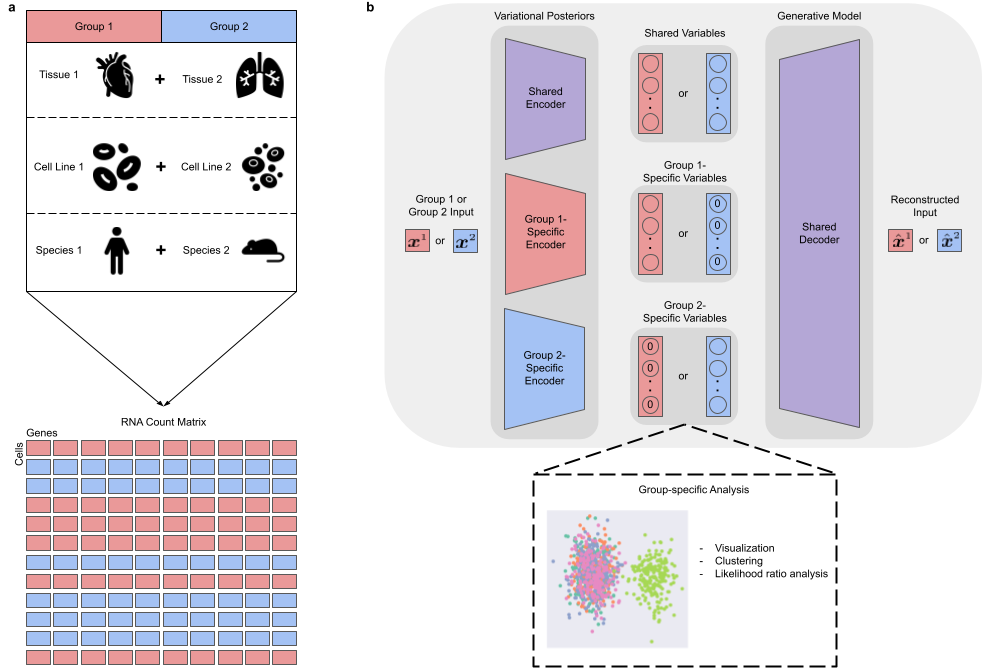

This repository contains an implementation of the multiGroupVI model described
in ["Disentangling shared and group-specific variations in single-cell transcriptomics data with multiGroupVI"](https://www.placeholder.com).



**Overview of multiGroupVI.** **a,** Given cells divided into non-overlapping groups of interest,
multiGroupVI deconvolves the variations shared across groups versus those specific to
individual groups. **b,** Schematic of the multiGroupVI model. A shared encoder
network embeds cells, regardless of group membership, into the model's shared latent
space, which captures variations shared across all groups. Group-specific encoders also
embed cells into group-specific latent spaces, which capture variations particular to a
given group. For a cell from a given group γ, the group-specific latent variables
for other groups γ' ≠ γ  are fixed to be zero vectors. Cells' latent
representations are decoded back to the full gene expression space using a shared
decoder. Here for simplicity we depict only two groups, though the model can natively
handle more groups by adding additional group-specific encoders.

## User guide


### Installation
Git clone or download this repository. Then navigate to the folder and run

```
pip install . 
```

### Example usage
A notebook demonstrating how to train a multiGroupVI model as well as for reproducing
our results on the scRNA-seq dataset considered in our paper can be found in
`notebooks/Haber/create_haber_region_dataset.ipynb`.

## References

```
@article{multiGroupVI,
  title={Disentangling shared and group-specific variations in single-cell transcriptomics data with multiGroupVI},
  author={Weinberger, Ethan and Lopez, Romain and Hütter, Jan-Christian and Regev, Aviv },
  booktitle={Proceedings of the 17th Machine Learning in Computational Biology meeting},
  year={2022},
  organization={PMLR}
}
```
